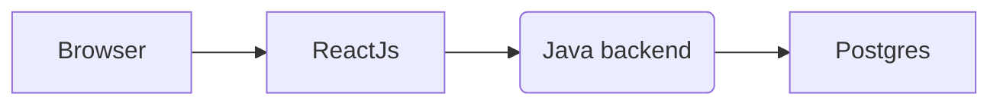

# postgres-java-webui

Yet another administration interface for PostgreSQL.
Purpose: To learn how to vibe code.

See [TODO.md](./TODO.md) for tasks.

## Architecture

```mermaid
graph LR;

Browser --> ReactJs --> BE("Java backend") --> Postgres 
```
